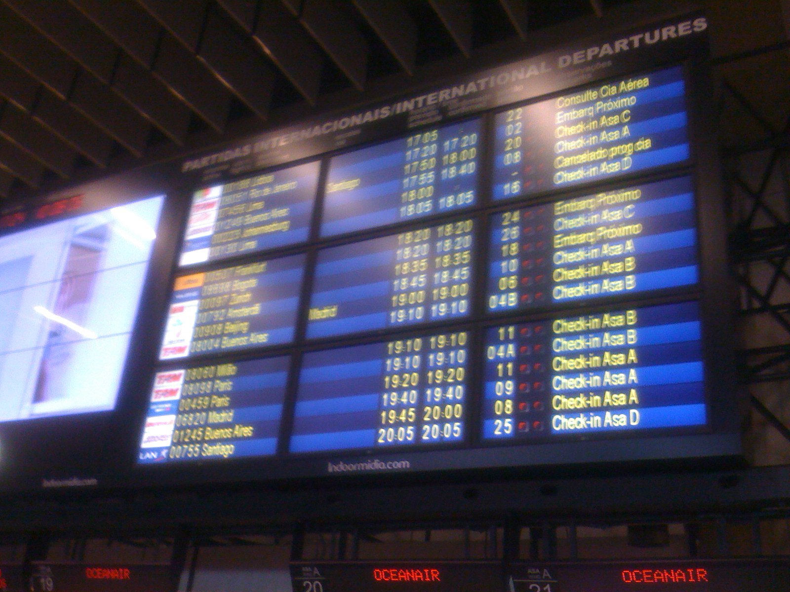

# FlapLabel
Airport style display components for Delphi Firemonkey. 
Simulates vintage mechanical flight information boards
( the ones with rolls of plates that change in sequence,
making a satisfying flap-flap noise ).

*Solari*-Udine Airport display panel.

FlapLabel was originaly developed in 2002 for actual 
flight information screens for São Paulo Airport (Congonhas). 

We used an array of 42" plasma displays, expensive at the time, 
in substitution to even more expensive mechanical boards from Solari.
The sw is still in use in that airport. The original components were for VCL. 

This is a port to Delphi Firemonkey and is tested
on Windows, iOS and Android w/ D10.4.1

## Installation

* Compile and install FlapLabelPkg.dpk (design time package) 
* Components *TFlapCharSet*, *TFlapChar* and *TFlapLabel* will be installed 

## Component Usage

To use FlapLabels you need at least two components on your form: TFlapCharset and TFlapLabel.

*TFlapCharset* contains the art to be used in FlapLabel plates. 

Depending on the application, you may use more than one charset: one with letters and one with just numbers.
Remember that all characters cycle until the desired is reached, so using long charsets is not recommended. 
In mechanical displays, the charset is a roll of plates connected by loops and an axis.

The charset BMP can be in any grid disposition ( columns and lines ). Plates must have equal sizes.

Each *TFlapLabel* uses one charset (roll). But a charset can be used by multiple FlapLabels. 

The default behaviour for FlapLabel characters is to transition in sequence until the target character is reached.
Each transition has 4 states. 

You can set TFlapLabel to "Go Direct" (cheat), changing to target state in a single transition  (see sample app).

* Add a *TFlapCharSet* to your form ( ex: FlapCharSet1 ) - Charset contains an image with the character set to be used by FlapLabels. 

* Plates BMPs are  cut from the master charset image, so you can add symbols or icons to your charset (see below)

* Set FlapCharSet properties
  * AirportCharset = 'ABCDEFGHIJKLMNOPQRSTUVWXYZ1234567890.! :'  - These are the chars in the bitmap, for look up
  * CharsetBMP = Load a PNG image with charset art (in this case a 240x250 image, shown below)
 
.

Set charset BMP grid size.
  * RowCount = 5              
  * ColCount = 8

Set frame size in pixels.
  * FrameWidth = 30
  * FrameHeight = 50
  
Number of frames
  * FrameCount = 40
  
 
* Add a TFlapLabel component to the Form (ex: FlapLabel1) 
* Set FlapLabel1.CharSet property to FlapCharSet1
* Set FlapLabel1.CountFlaps number of digits in the label. This is the maximun lenght of the display text. 
* Set FlapLabel1.Caption to 'TEST'  (case sensitive)

The flaplabel should animate with transitions from current state and until target 'TEST' is reached.
Note that the component dows not produce any sound ( as the name might imply )

# Sample charsets

 - tri-state up/down indication.

 - number only fields.

 - Some airline logos. 

To change FlapLabel text at run time, just change FlapLabel1.Caption
Note that you can only use characters that are in your charset.
Text is truncated if size is larger then CountFlaps ( the fixed numbers of characters in the label)

## Example

Compile and run TestFlapLabel.dpr ( see screen shot )

## Using TFlapLabels with styles

After installing FlapLabel package, you can use the components in styles.
For example, say you want to code a TListBox with customized TListBoxItem.
Each Item will have controls showing item details. See video sample.

The item can be edited with the Delphi Style Editor.
It can include any controls. ex: TLabels, TImages, TFlapLabels,
disposed in a custom design.

To create the listbox item at run time and populate it:

      Item := TListBoxItem.Create(nil);           // create styled TListBoxItem
      Item.Parent := StockListbox;                // parent to our TListBox
      Item.StyleLookup := 'MyStockItemStyle';     // set style name. Same as created in the style designer
      
      Item.StylesData['labCod.Text']     := myStockItem.Cod;           // use StylesData to set control properties
      Item.StylesData['labName.Text']    := myStockItem.Name; 
      Item.StylesData['FlapPrice.Caption']  := myStockItem.PriceStr;   // set flap label on the style. This will start the animation 
      
      Item.StylesData['btnEditItem.OnClick']     := TValue.From<TNotifyEvent>(DobtnEditClick);          // hook button click
      Item.StylesData['btnLineEdDelete.OnClick'] := TValue.From<TNotifyEvent>(DobtnLineEdDeleteClick);  // hook delete btn click

## tiktok videos

* demo screen: https://www.tiktok.com/@omar_reis/video/6829300494842793222
* worst day on the Stock Market (app NassauSt): https://www.tiktok.com/@omar_reis/video/6802287150411877638
* AirlinerAttitude w/ FiremonkeySensorFusion and TFlapLabel: https://www.tiktok.com/@omar_reis/video/6846360497550380294  

## São Paulo GRU airport display

The photo below ( from 2005 ) shows an array of 9 plasma displays (42") with flight information.

Have fun..

